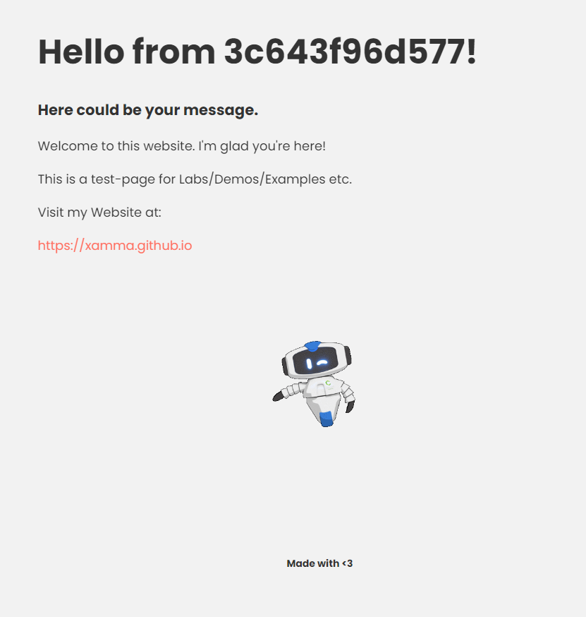

# Apikube

[](https://github.com/xamma/Apikube/actions/workflows/docker-image.yml)

This project is meant to learn Kubernetes and how to build Microservices.  
You can configure the static website with a ConfigMap.  
Also you will see the different hostnames, when the deployment handles multiple replicas.  



## The App

Cloudnative Microservice written in Python using FastAPI for the API.  
Frontend is just simple static HTML content rendered with Jinja2.  
Allows passing ENVs via ConfigMap in Kubernetes and can be further configured with Helm Charts.  

## How to run

### Build Docker image
```
docker build -t apikube:latest .
```

### Run Docker container
```
docker run -dp 80:8000 apikube:latest
OR
docker run -dp 80:8000 ghcr.io/xamma/apikube:latest
```

### Deploy to Kubernetes
```
kubectl create ns apikube
kubectl apply -f k8s-manifests
```
Note: I'm using GitOps with ArgoCD for deployments.  